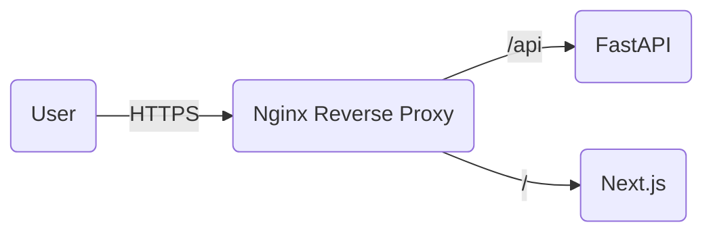

# PDF Tools (Production Ready)

A production-grade, legally compliant PDF manipulation tool suite.

## Architecture (Production)


## Features
- **Secure**: Strict password validation (No cracking), HTTPS-ready, Rate Limiting (30/min).
- **Private**: No file retention. Files deleted immediately or within 10 mins.
- **Microservices**: Frontend and Backend orchestrated via Docker Compose.

## Real-World Configuration

### 1. Environment Variables
Copy `.env.example` to `.env` in both folders before running.

**Backend (.env)**
```ini
APP_ENV=production
MAX_FILE_SIZE_MB=25
RATE_LIMIT_PER_MIN=30
CORS_ORIGINS=https://yourdomain.com
```

**Frontend (.env)**
```ini
NEXT_PUBLIC_API_URL=/api
```

### 2. Deployment
Run the full stack with Nginx:

```bash
docker-compose up --build -d
```

- **Application**: [http://localhost](http://localhost) (Proxied via Nginx)
- **API (Internal)**: Not exposed directly. Accessed via `http://localhost/api`.

### 3. Production Hardening Checklist
- [x] Nginx Reverse Proxy configured.
- [x] Backend Swagger disabled in production mode.
- [x] Rate limiting enabled (30 req/min).
- [x] Legal pages (/privacy, /terms) included.
- [x] Strict file auto-deletion verified.

## Legal Disclaimer
This tool strictly follows legal compliance. "Unlock PDF" functionality requires the user to possess the correct password. We do not provide password cracking services.
